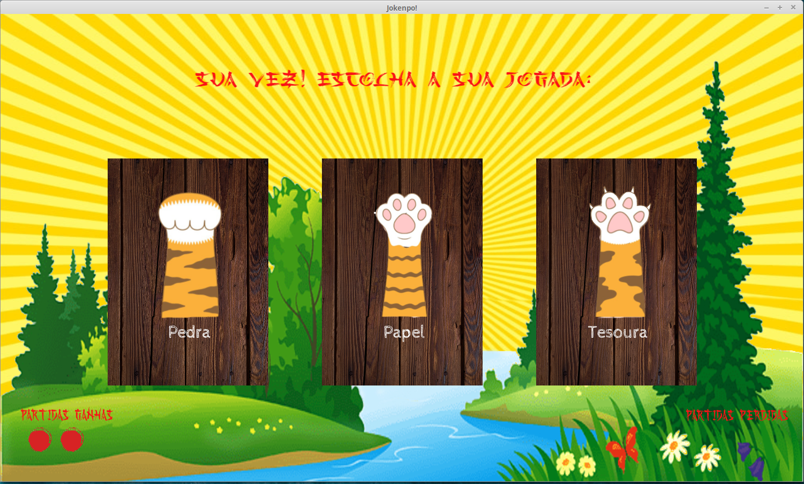

# Jokenpo Game with Java FX and Socket


### 📝 About the project
- This project was developed to create a communication between 2 processes: the client and the server.
- For the sake of simplification, both processes are run in the same machine.
- The final result was 2 programs that communicate through a socket connection.
---
### 💻 Screens



---
### 👨‍💻 Technologies
- [Java](https://www.oracle.com/technetwork/pt/java/javase/downloads/index.html)
- [Java FX](https://openjfx.io/)
---
### ▶ How to run this project
- Download this two projects

```bash 
# clone this repository to your machine (it's our client)
$ git clone https://github.com/Hildemir/JokenpoTCPClient

# clone this too (it's our server)
$ git clone https://github.com/Hildemir/JokenpoTCPServer
```

1. [Download Java](https://www.oracle.com/technetwork/pt/java/javase/downloads/index.html)
    - [Setup enviroment](https://www.tutorialspoint.com/java/java_environment_setup.htm)
2.  [Download JavaFX](https://openjfx.io/)
3.  Add JavaFX to your IDE
4.  You should first run the server an then the client.
---
Developed by [Hildemir Regis](https://github.com/Hildemir) and [Bianca Guerra](https://github.com/biawar) 😜